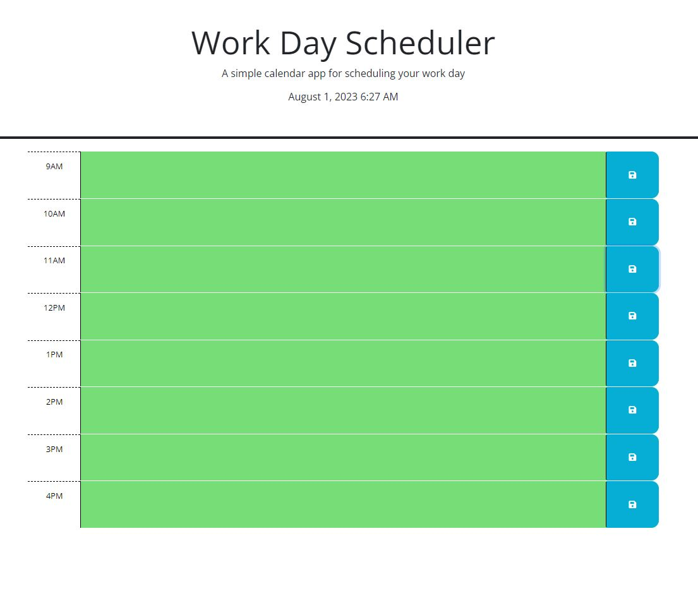
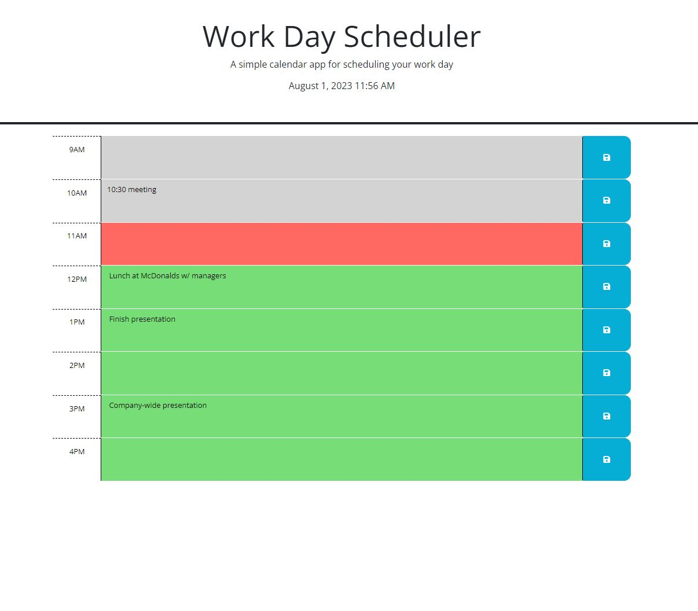

# Work-Day-Scheduler

## Description

This code creates a Work Day Scheduler, including a current time and date. There are color coded time blocks for every hour of the work day, future hours will be green, the current hour will be red, and all hours that have past will be grey. You also have the ability to input and save text into the time blocks.

## Installation

N/A

## Usage

[link to landing page](https://raw.githack.com/Akleynhans/Work-Day-Scheduler/main/index.html)

 
Blank Scheduler in the morning showing the day ahead of you.

 
Scheduler in the middle of the work day showing current working hour, as well as past and future hours. Also displaying saved text in the time blocks.

## Credits

[link to create li items from an array](https://getbutterfly.com/generate-html-list-from-javascript-array/) 
[link to find index of item in an array](https://herewecode.io/blog/replace-item-array-javascript/#:~:text=The%20Definitive%20Guide%22%20%7D-,If%20you%20want%20to%20replace%20an%20object%20in%20an%20array,not%20met%20in%20the%20array) 
[link to forEach() tutorial](https://developer.mozilla.org/en-US/docs/Web/JavaScript/Reference/Global_Objects/Array/forEach) 

